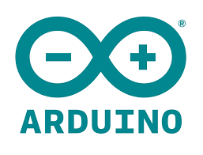

# Arduino

## Description

 Arduino est la marque d'une plateforme de prototypage open-source qui permet aux utilisateurs de créer des objets électroniques interactifs à partir de cartes électroniques matériellement libres sur lesquelles se trouve un microcontrôleur (d'architecture Atmel AVR comme l'Atmega328p, et d'architecture ARM comme le Cortex-M3 pour l'Arduino Due). 

## Source
|Nom|type|Langue|Lien|Description|Tags|Note|
|---|---|---|---|---|---|---|
|Arduino|Site officiel|Anglais|https://www.arduino.cc/|Site officiel de Arduino|News|4 :star: |
|Wikipedia|Encyclopédie libre|Français|https://fr.wikipedia.org/wiki/Arduino|Informations générales sur Arduino|Infos|5 :star: |
|Zeste de savoir|Blog|Français|https://zestedesavoir.com/tutoriels/686/arduino-premiers-pas-en-informatique-embarquee/742_decouverte-de-larduino/3416_le-logiciel/|Tutoriel de démarrage pour arduino|Infos|3 :star: |
|Conrad|Site de vente|Français|https://www.conrad.fr/fr/marques/arduino.html|Site de vente spécialisé dans l'électronique où l'on trouve Arduino|Tuto|5 :star:|
|LinkedIn|Réseau social|Anglais|https://www.linkedin.com/company/arduino/|Dernières infos sur la puce Arduino|News| 4 :star:|