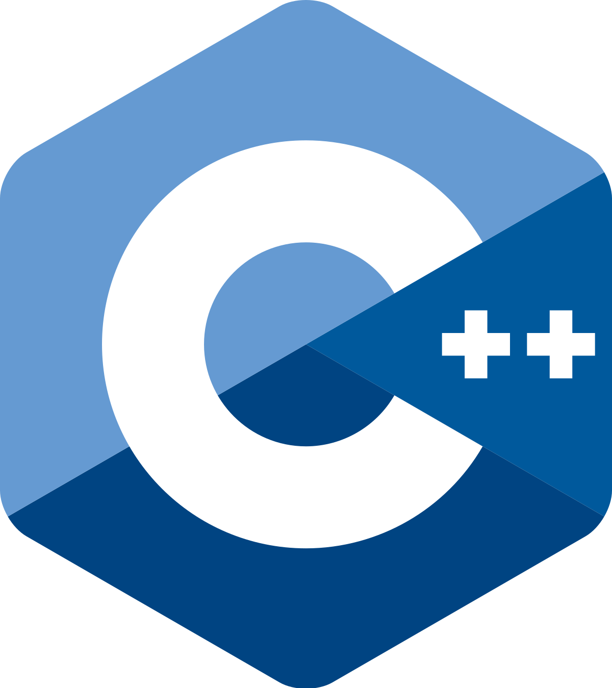

# C++

{width=250px}

## Description
C++ est un langage de programmation polyvalent et orienté objet, dérivé du C, utilisé pour le développement de logiciels et de jeux.

Créé initialement par Bjarne Stroustrup dans les années 1980, le langage C++ est aujourd'hui normalisé par l'ISO. Sa première normalisation date de 1998 (ISO/CEI 14882:1998), ensuite amendée par l'erratum technique de 2003 (ISO/CEI 14882:2003). Une importante mise à jour a été ratifiée et publiée par l'ISO en septembre 2011 sous le nom de ISO/IEC 14882:2011, ou C++113. Depuis, des mises à jour sont publiées régulièrement : en 2014 (ISO/CEI 14882:2014, ou C++144), en 2017 (ISO/CEI 14882:2017, ou C++175) puis en 2020 (ISO/IEC 14882:2020, ou C++206). 

**Source :** [lien wikipédia](https://fr.wikipedia.org/wiki/C%2B%2B)

## Veille Techno
Nom  | Type  | Langue | Lien | Description | Tags | Note
------|-------|--------|------|-------------|------|------
Cours d'initiation C++ | PDF | Français | [lien de l'article](https://www.fresnel.fr/perso/stout/langage_C/Chap_1_Notions_de_base.pdf) | Un cours expliquant les bases à connaitre sur C++ | #GIT #Logiciel | 5 :star:
ZDNET | Site | Français | [lien de l'article](https://www.zdnet.fr/actualites/c-c-4000002340q.htm) | Un blog regroupant de nombreux articles sur les nouveautés autour de C et C++ | #C++ #Blog | 3 :star: |
Site Microsoft Developpement | Site | Anglais | [lien de l'article](https://devblogs.microsoft.com/cppblog/) | Site officiel de microsoft, contenant les notes de mise à jour des derniers changement sur différents language, dont C++ | #C++ #Blog #Microsoft | 5 :star:
CPP-Reference|Référence langage|Anglais|https://en.cppreference.com/w/cpp/language/history|Références des versions de C++|#Historique|4 :star:
