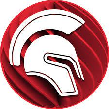

# Delphi

# Description
Delphi est un EDI propriétaire fonctionnant sous Windows créé en 1995 par Borland. À l'époque, créer des programmes graphiques sous Windows se faisait en grande majorité en utilisant soit la chaîne de compilation Visual C++, soit le RAD Visual Basic. Le premier outil étant excessivement complexe et le second assez peu structuré, Delphi apparut alors comme une alternative viable pour beaucoup de développeurs qui souhaitaient créer des programmes pour Windows. 

# Sources
|Nom|type|Langue|Lien|Description|Tags|Note|
|---|---|---|---|---|---|---|
|Embarcadero|Site officiel|Français|https://www.embarcadero.com/fr/products/delphi|Site officiel de Delphi|Infos|4 :star:|
|Wikipedia|Encyclopédie Libre|Français|https://fr.wikipedia.org/wiki/Delphi_(langage)|Informations générales|Infos|4 :star:|
|Developpez|Forum|Français|https://delphi.developpez.com/|Tutoriels|Tutos| 4 :star:|
|ENI|Livre|Français|https://www.editions-eni.fr/livre/delphi-10-3-programmation-orientee-objet-en-environnement-windows-9782409024665|Apprentissage|Tutos|5 :star:|