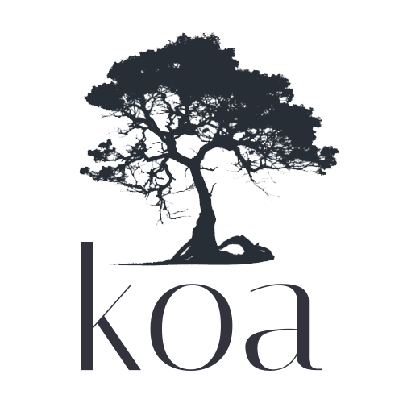

# KOA

{width=250px}

## Description
Koa.js est un framework web léger pour Node.js, mettant l'accent sur la simplicité et la gestion asynchrone à l'aide de générateurs ES6. Il favorise l'utilisation de middleware pour créer des applications modulaires et flexibles.

<!-- _**Source :** [lien wikipédia]() -->

## Veille Techno
Nom  | Type  | Langue | Lien | Description | Tags | Note
------|-------|--------|------|-------------|------|------
Site Officiel de Koa | Site | Anglais | [lien de l'article](https://koajs.com/) | Ce site décrit le framework Koa pour Node.js, plus petit et expressif qu'Express. |#KOA #Framework | 4/5
